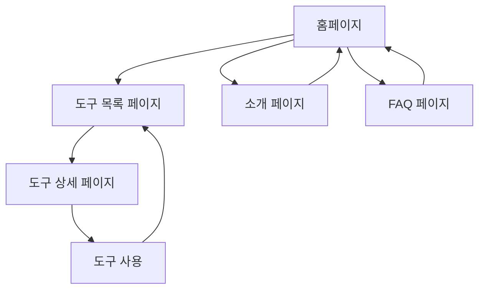

# 온라인 도구 모음 랜딩페이지 - 제품 요구사항 문서

## 1. Product Overview
99onlinetools.com과 유사한 화이트/블루 톤의 모던한 온라인 도구 모음 랜딩페이지입니다. <mcreference link="https://99onlinetools.com/" index="0">0</mcreference>
- 사용자들에게 다양한 무료 온라인 유틸리티 도구를 제공하며, 회원가입 없이 즉시 사용 가능한 서비스를 목표로 합니다.
- 깔끔하고 전문적인 디자인으로 사용자 경험을 최적화하여 일상적인 작업을 효율적으로 처리할 수 있도록 지원합니다.

## 2. Core Features

### 2.1 User Roles
역할 구분이 필요하지 않은 단순한 구조로 설계됩니다.

### 2.2 Feature Module
온라인 도구 모음 랜딩페이지는 다음 주요 페이지들로 구성됩니다:
1. **홈페이지**: 히어로 섹션, 네비게이션, 주요 기능 소개, 도구 카테고리 미리보기
2. **도구 목록 페이지**: 전체 도구 컬렉션, 카테고리별 필터링, 검색 기능
3. **도구 상세 페이지**: 개별 도구 사용 인터페이스, 사용법 안내
4. **소개 페이지**: 서비스 소개, 특징 및 장점 설명
5. **FAQ 페이지**: 자주 묻는 질문과 답변

### 2.3 Page Details

| Page Name | Module Name | Feature description |
|-----------|-------------|---------------------|
| 홈페이지 | 히어로 섹션 | 메인 타이틀, 서브타이틀, CTA 버튼으로 구성된 임팩트 있는 첫 화면 |
| 홈페이지 | 네비게이션 바 | 로고, 메인 메뉴(도구, 소개, FAQ), 반응형 햄버거 메뉴 |
| 홈페이지 | 특징 소개 섹션 | 빠른 속도, 보안성, 무료 사용 등 핵심 가치 제안을 아이콘과 함께 표시 |
| 홈페이지 | 도구 미리보기 | 인기 도구들의 카드 형태 미리보기, 카테고리별 분류 |
| 홈페이지 | 통계 섹션 | 사용 가능한 도구 수, 사용자 수 등 신뢰도를 높이는 수치 정보 |
| 홈페이지 | 푸터 | 저작권 정보, 소셜 미디어 링크, 추가 메뉴 |
| 도구 목록 페이지 | 도구 그리드 | 모든 도구를 카드 형태로 표시, 호버 효과 및 클릭 액션 |
| 도구 목록 페이지 | 필터링 시스템 | 카테고리별 필터, 검색창, 정렬 옵션 |
| 도구 상세 페이지 | 도구 인터페이스 | 실제 도구 사용을 위한 입력/출력 영역 |
| 도구 상세 페이지 | 사용법 안내 | 단계별 사용 방법, 팁 및 주의사항 |
| 소개 페이지 | 서비스 소개 | 미션, 비전, 서비스의 목적과 가치 설명 |
| 소개 페이지 | 기능 상세 설명 | 로컬 처리, 보안성, 접근성 등 기술적 특징 설명 |
| FAQ 페이지 | 질문 답변 목록 | 아코디언 형태의 FAQ, 검색 기능 |
| FAQ 페이지 | 문의하기 섹션 | 추가 문의를 위한 연락처 정보 |

## 3. Core Process

**사용자 플로우:**
사용자는 홈페이지에서 서비스를 소개받고, 필요한 도구를 찾아 즉시 사용할 수 있습니다. 회원가입이나 로그인 과정 없이 모든 기능에 바로 접근 가능합니다.

## 4. User Interface Design

### 4.1 Design Style
- **Primary Colors**: 화이트 (#FFFFFF), 블루 (#2563EB, #3B82F6)
- **Secondary Colors**: 라이트 그레이 (#F8FAFC), 다크 그레이 (#64748B)
- **Button Style**: 둥근 모서리(8px radius), 그라데이션 효과, 호버 시 색상 변화
- **Font**: Inter, Pretendard (한글), 16px 기본 크기, 24px 제목
- **Layout Style**: 카드 기반 레이아웃, 상단 고정 네비게이션, 그리드 시스템
- **Icon Style**: Lucide React 아이콘, 미니멀하고 일관된 스타일

### 4.2 Page Design Overview

| Page Name | Module Name | UI Elements |
|-----------|-------------|-------------|
| 홈페이지 | 히어로 섹션 | 중앙 정렬, 대형 타이틀(48px), 그라데이션 배경, CTA 버튼(파란색, 그림자 효과) |
| 홈페이지 | 특징 소개 | 3열 그리드, 아이콘(64px), 카드 형태, 호버 시 살짝 상승 효과 |
| 홈페이지 | 도구 미리보기 | 4열 그리드(모바일 2열), 카드 디자인, 둥근 모서리, 그림자 효과 |
| 도구 목록 페이지 | 필터링 | 상단 고정 필터 바, 드롭다운 메뉴, 검색창(아이콘 포함) |
| 도구 목록 페이지 | 도구 그리드 | 반응형 그리드(데스크톱 4열, 태블릿 3열, 모바일 2열), 카드 호버 효과 |
| FAQ 페이지 | 아코디언 | 질문 클릭 시 부드러운 확장 애니메이션, 플러스/마이너스 아이콘 |

### 4.3 Responsiveness
데스크톱 우선 설계이지만 모바일 최적화를 고려한 완전 반응형 디자인입니다. 터치 인터랙션 최적화를 포함하여 모든 디바이스에서 원활한 사용 경험을 제공합니다.