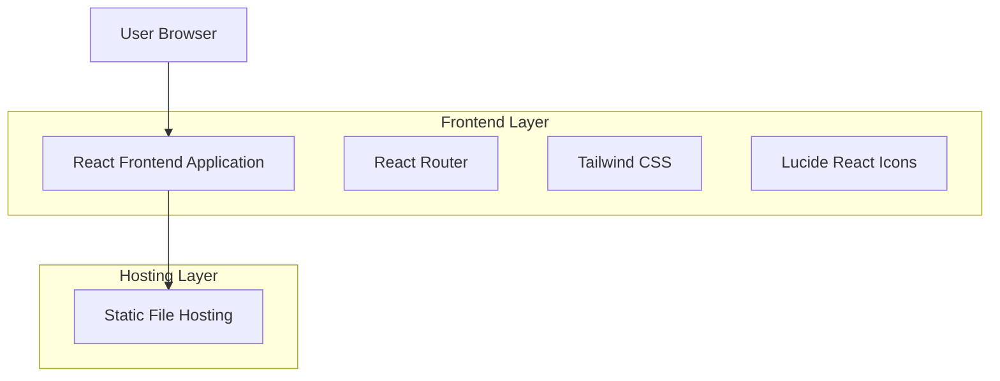
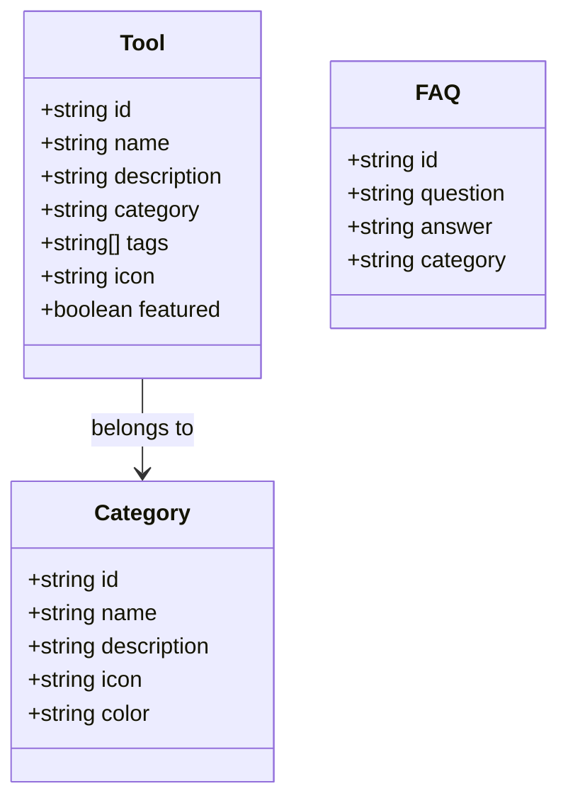

# 온라인 도구 모음 랜딩페이지 - 기술 아키텍처 문서

## 1. Architecture Design



## 2. Technology Description

* Frontend: React\@18 + TypeScript\@5 + Vite\@5 + Tailwind CSS\@3 + React Router\@6

* Icons: Lucide React

* Backend: None (정적 사이트)

## 3. Route Definitions

| Route          | Purpose                             |
| -------------- | ----------------------------------- |
| /              | 홈페이지, 메인 랜딩 페이지와 서비스 소개             |
| /tools         | 도구 목록 페이지, 모든 사용 가능한 도구들을 카테고리별로 표시 |
| /tools/:toolId | 도구 상세 페이지, 개별 도구의 사용 인터페이스          |
| /about         | 소개 페이지, 서비스에 대한 상세 정보와 특징           |
| /faq           | FAQ 페이지, 자주 묻는 질문과 답변               |
| /contact       | 연락처 페이지, 문의 및 피드백 양식                |

## 4. API Definitions

이 프로젝트는 정적 사이트로 별도의 백엔드 API가 필요하지 않습니다. 모든 도구는 클라이언트 사이드에서 JavaScript로 처리됩니다.

## 5. Server Architecture Diagram

백엔드 서비스가 없는 정적 사이트입니다.

## 6. Data Model

### 6.1 Data Model Definition

데이터베이스를 사용하지 않으며, 모든 데이터는 정적 JSON 파일이나 TypeScript 상수로 관리됩니다.



### 6.2 Data Definition Language

데이터베이스를 사용하지 않으므로 DDL이 필요하지 않습니다. 대신 TypeScript 인터페이스로 데이터 구조를 정의합니다:

```typescript
// 도구 인터페이스
interface Tool {
  id: string;
  name: string;
  description: string;
  category: string;
  tags: string[];
  icon: string;
  featured: boolean;
  path: string;
}

// 카테고리 인터페이스
interface Category {
  id: string;
  name: string;
  description: string;
  icon: string;
  color: string;
}

// FAQ 인터페이스
interface FAQ {
  id: string;
  question: string;
  answer: string;
  category: string;
}

// 초기 데이터 예시
const TOOLS: Tool[] = [
  {
    id: 'pdf-converter',
    name: 'PDF 변환기',
    description: '다양한 파일 형식을 PDF로 변환하거나 PDF를 다른 형식으로 변환',
    category: 'converter',
    tags: ['pdf', 'converter', 'document'],
    icon: 'FileText',
    featured: true,
    path: '/tools/pdf-converter'
  },
  {
    id: 'image-resizer',
    name: '이미지 리사이저',
    description: '이미지 크기를 조정하고 최적화',
    category: 'image',
    tags: ['image', 'resize', 'optimize'],
    icon: 'Image',
    featured: true,
    path: '/tools/image-resizer'
  }
];

const CATEGORIES: Category[] = [
  {
    id: 'converter',
    name: '변환 도구',
    description: '파일 형식 변환 관련 도구들',
    icon: 'RefreshCw',
    color: 'blue'
  },
  {
    id: 'image',
    name: '이미지 도구',
    description: '이미지 편집 및 처리 도구들',
    icon: 'Image',
    color: 'green'
  }
];
```

